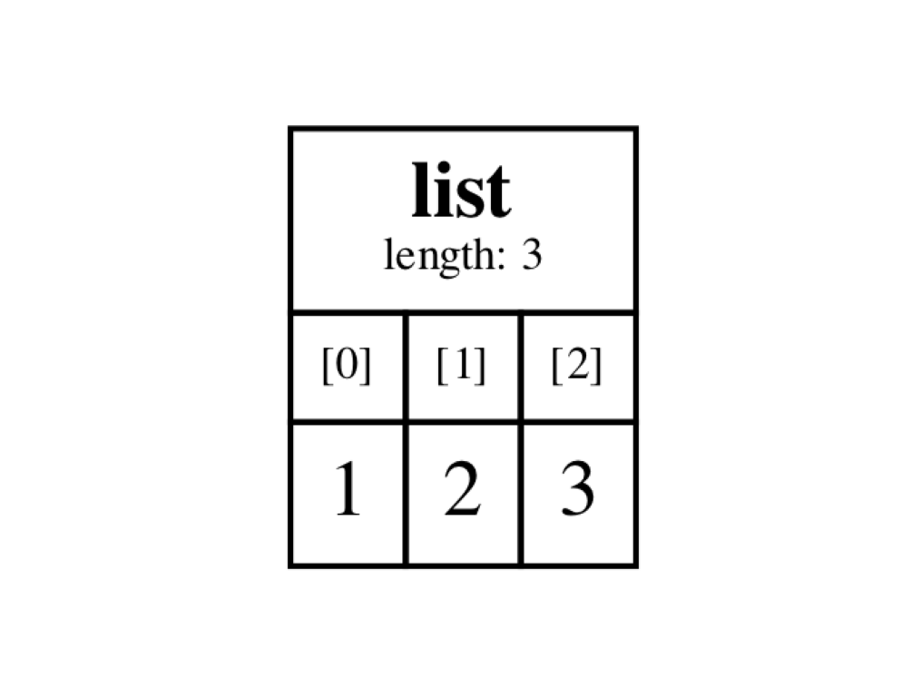

# Structoscope


Structoscope is a Python library for visualizing and inspecting any data structure.

### What's up with the name?

I think of it as a *stethoscope* whose purpose is to inspect a `struct`. A Struct-o-scope!

### Quick Example

This is how you display a list:

#### Input
```python
from structoscope import Scope

s = Scope("Test list")
testList = [
    [1,2],
    [
        ['a', 'b'],
        ['c', 'd']
    ],
    'abc'
]
s.printList(testList)
```

#### Output

